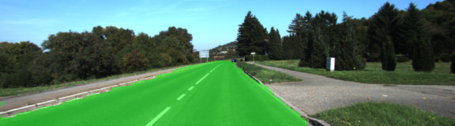

# Semantic Segmentation
### Overview

In this project, trained the Full Convolutional Network to identify road pixels in the image. Starting with the VGG16 pretrained model, Built FCN by adding a skip layer, 1x1 convolution and transposed convolution.

### Running 
It is very easy. Just run `main.py`. using a GTX 1070 it takes about 10 minutes to train.

### Setup
##### Frameworks and Packages
Make sure you have the following is installed:
 - [Python 3](https://www.python.org/)
 - [TensorFlow](https://www.tensorflow.org/)
 - [NumPy](http://www.numpy.org/)
 - [SciPy](https://www.scipy.org/)
##### Dataset
Download the [Kitti Road dataset](http://www.cvlibs.net/datasets/kitti/eval_road.php) from [here](http://www.cvlibs.net/download.php?file=data_road.zip).  Extract the dataset in the `data` folder.  This will create the folder `data_road` with all the training a test images.